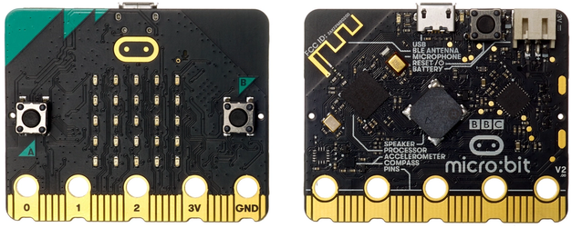
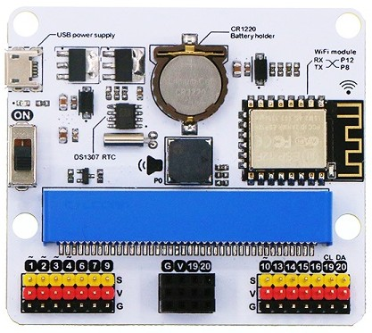
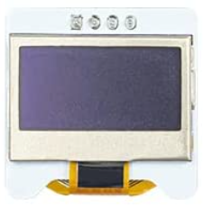
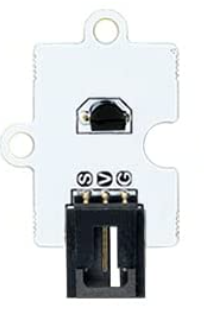
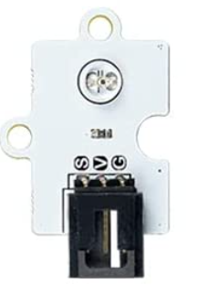
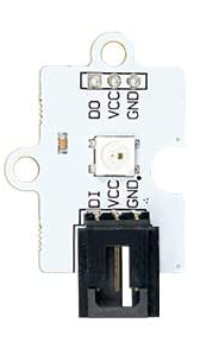
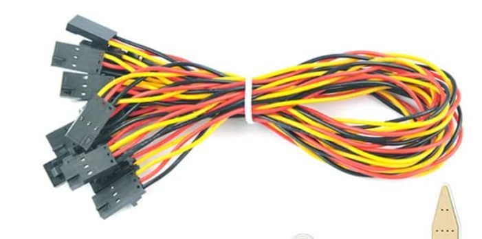
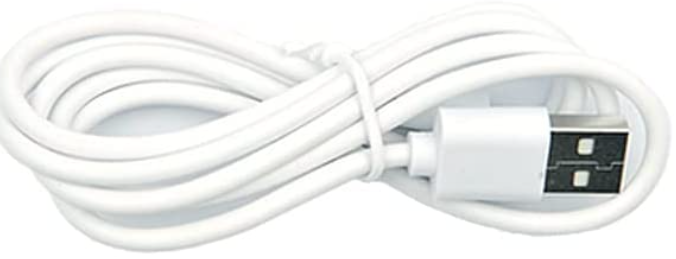
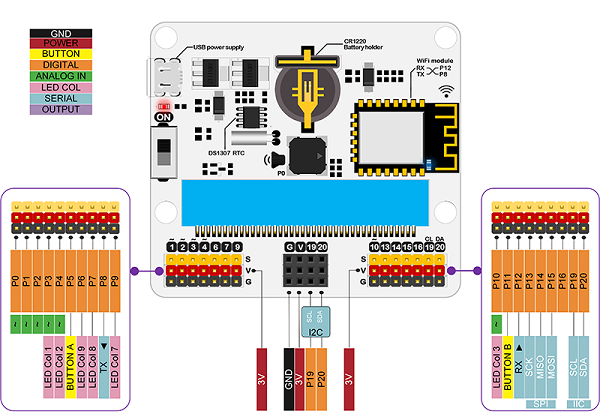

# Componentes

Vamos a utilizar estos componentes:

micro:bit

Placa IOT:bit

Pantalla OLED

Sensor de temperatura

Sensor de luz

Led RGB

3 x Cables conexión de los sensores

Cable USB

# Servidor

Raspberry Pi 4

## Más detalles

    