# Montaje

## Simulador micro:bit mostrando un emoticono

Necesitamos:

* micro:bit
* cable USB
* [https://makecode.microbit.org](https://makecode.microbit.org)

Desde la página de makecode pulsamos en "Nuevo proyecto" y le ponemos de nombre "emoticonos" y pulsamos el botón "Crear"

Vamos a usar el editor de bloques de Makecode   

En la paleta básico encontramos bloques para mostrar dibujos en su pantalla de 5x5 leds

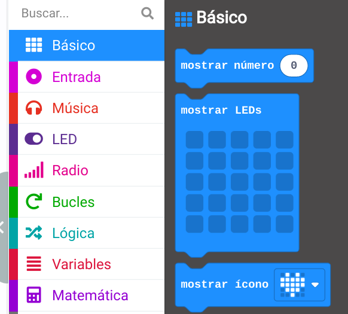

Arrastramos el bloque "mostrar icono" dentro del bloque "Para siempre" que tiene forma de "C"

Verás que el simulador de micro:bit que se muestra a la izquierda de la página mostrará el icono.

Ahora podemos seleccionar nuestro icono/dibujo preferido, y el simulador hará lo mismo

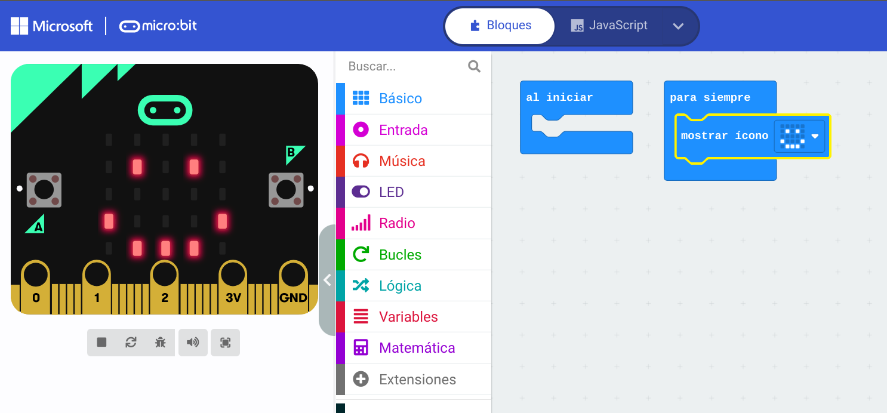

Si añades otro bloque de mostrar icono se mostrarán alternativamente los 2 dibujos en la pantalla

Incluso puedes crear tu propio dibujo  usando el bloque "Mostrar leds"

[Ejemplo](https://makecode.microbit.org/_DemH1JcjEJae)

Ahora vamos a pasar el programa a nuestra placa micro:bit

Siempre que queramos que el programa funcione en nuestra placa tenemos que pulsar el botón "Descargar"

La primera vez tenemos que hacer este proceso:

* Conectamos la micro:bit con el cable USB al ordenador
* Pulsamos en el botón de los 3 puntitos la opción 

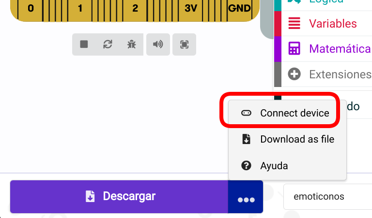

* Aparece una ventana y el nombre de nuestra placa en ella

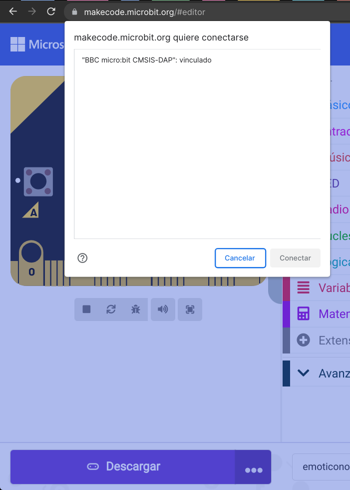

* La seleccionamos y pulsamos "Conectar"

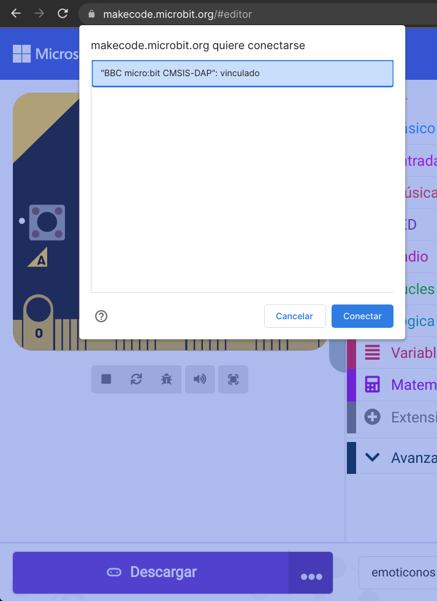

El icono del botón "Descargar" cambia, mostrando el logo de micro:bit, lo que quiere decir que ya está emparejada

* Pulsamos el botón "Descargar" y tras unos segundos, en los que parpadea el led naranja de la parte de atrás de nuestra micro:bit, ya la tenemos programada y ejecutando nuestro programa.

Este proceso es similar al emparejamiento bluetooth de dispositivos con lo que en las placas que ya se han emparejado con un ordenador no habrá que repetirlo.

## Termómetro en la pantalla

Necesitamos:

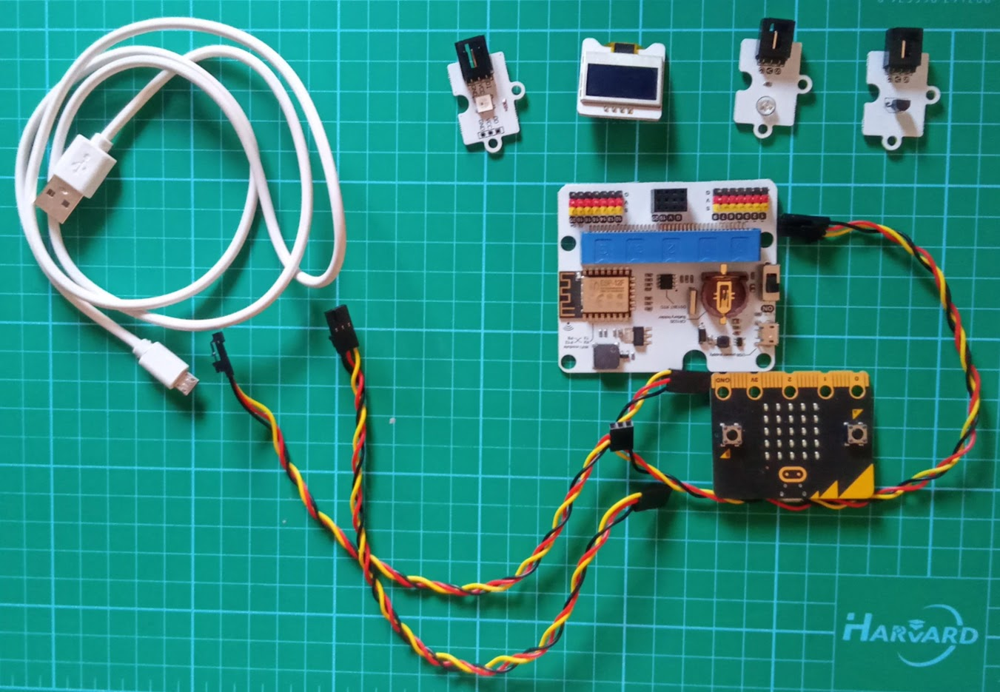

* micro:bit
* Cable USB
* Placa IOT:bit
* Pantalla OLED
* Sensor temperatura
* Sensor luz
* LED RGB
* 3 cables de sensores

### Montaje

**¡¡TODO EL MONTAJE  SE HACE CON LA PLACA DESCONECTADA!!**

* Conectamos la pantalla 

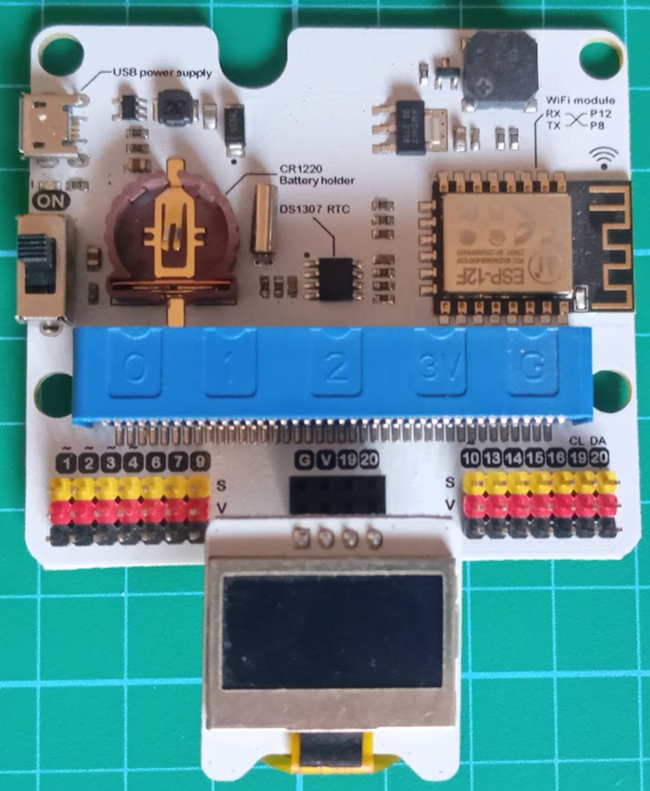

* Conectamos el sensor de luz en P1 ¡¡OJO A LOS COLORES!!
    * Cable amarillo - Pin amarillo
    * Cable rojo - Pin Rojo
    * Cable negro - Pin Negro

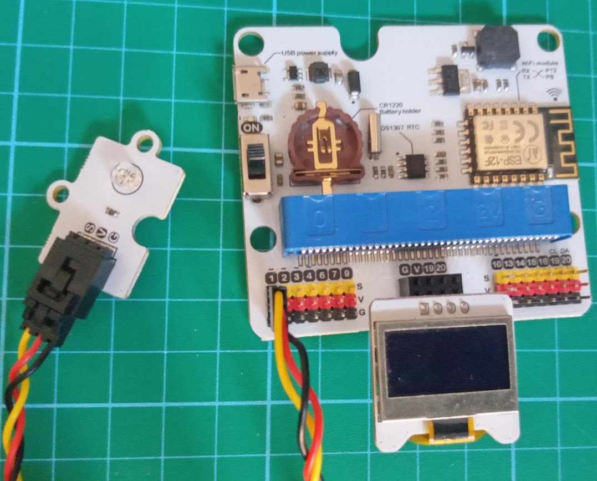

* Conectamos el sensor de temperatura en P2

* Conectamos el led al pin P16

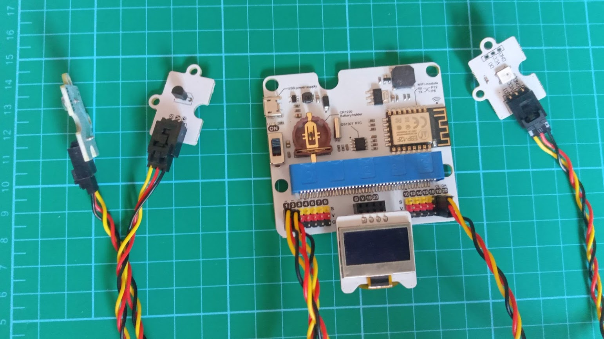

### Programación

* Creamos un nuevo proyecto pulsado en el logo de microbit

Para usar los sensores vamos a necesitar nuevos bloques y por eso vamos a incluir la extensión de nuestros sensores y componentes.

Pulsamos en "Extensiones"

Y buscamos la extensión "Smarthome"

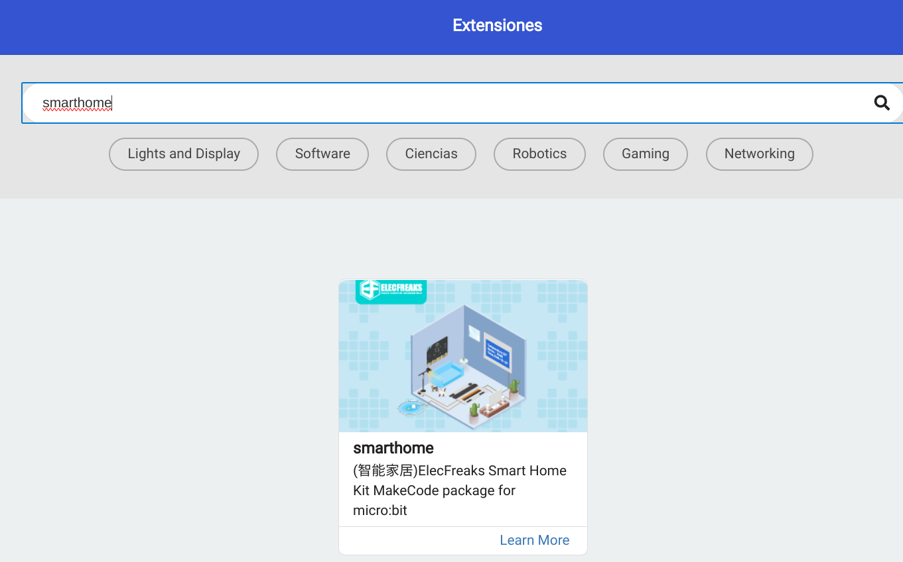

Tras pulsar sobre ella aparecerán nuevas paletas de bloques

Vamos a mostrar un texto en la pantalla

* Abrimos la paleta "OLED"

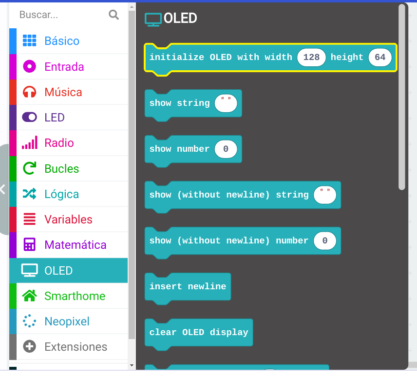

* Añadimos los bloques de "Initialize OLED ...." y "show string..." ¡¡Hay que aprender inglés!! 

* Completaremos con un saludo

* Reprogramamos nuestra micro:bit y veremos el saludo en pantalla

* Añadimos el bloque de borrado de la pantalla "clear OLED display" y el de "show number" de la paleta OLED

* Ahora abrimos la paleta "Smarthome" y añadimos el bloque "value of temperature..." dentro del anterior "show number"

* Seleccionamos P2 que es donde hemos conectado nuestro sensor

* La micro:bit funciona muy rápido. Por eso vamos a añadir un pequeño retardo para que nos dé tiempo a leer el valor de la temperatura. Abrimos la paleta "Básico" y cojemos el bloque "pausa"

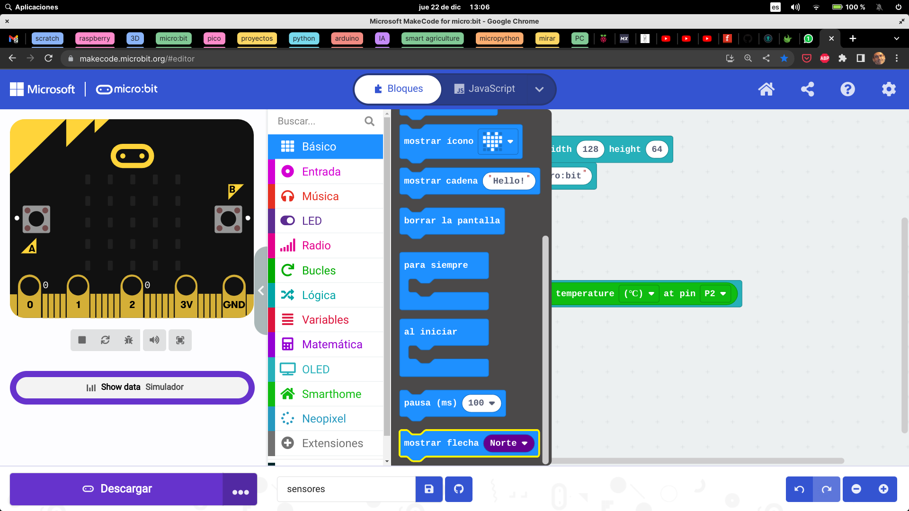

Nuestro programa queda así:

Programamos nuestra placa y veremos los valores en pantalla

Para que mida mejor cambiamos el cable USB para que alimente la placa IOT:bit

[Programa: termómetro](https://makecode.microbit.org/_aXR3UD7g4f17)

