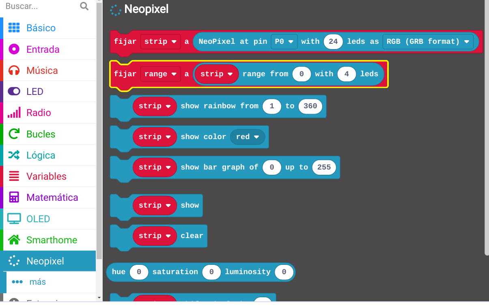
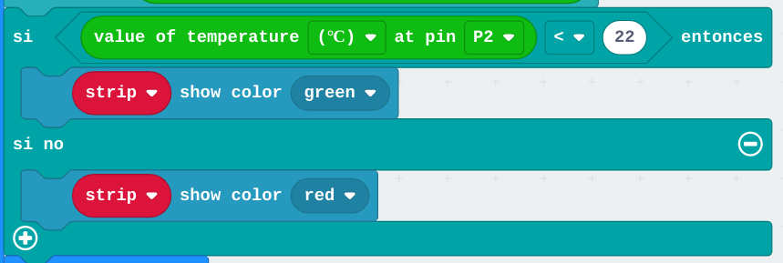
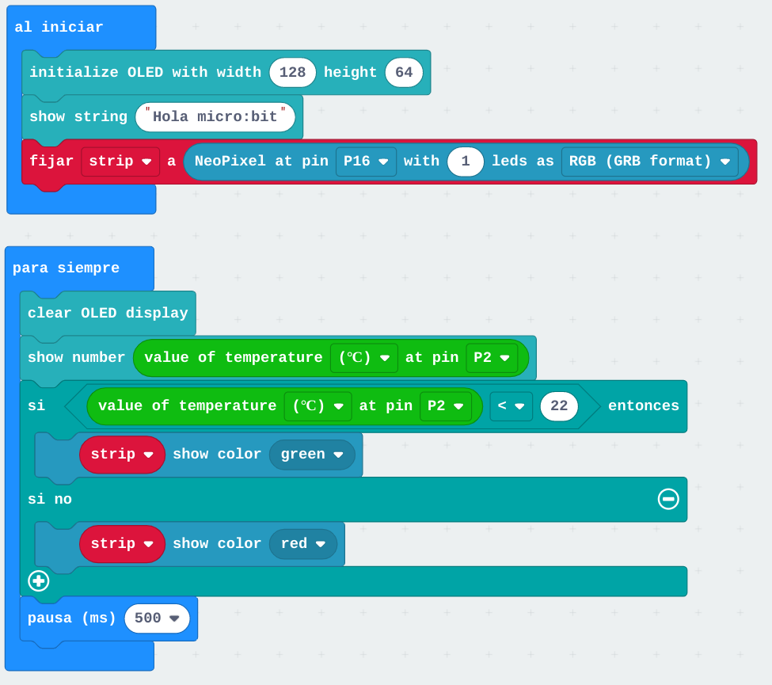

### Proyecto Termostato

Si queremos convertir nuestro termómetro en un termostato:

* Vamos a comparar la temperatura con un valor dado:
    * Si es superior encendemos el led rojo
    * Si es menor lo encendemos verde

* Abrimos los componentes de la paleta lógica y cojemos "Si verdadero...si no" y el operador "<" que pondremos sobre el hexágono "verdadero"

* Ponemos otro bloque de "value of temperature ..." (Recuerda cambiar el pin a P2) y asignamos una temperatura umbral

* Abrimos la paleta neopixel para controlar nuestro led RGB ¿qué significa RGB?

* Añadimos un bloque de configuración del neopixel en la parte de configuración en "al iniciar"

* Añadimos un bloque "show color red" y otro "show color green" dentro del bloque "Si...si no"

El programa completo queda así:

Reprogramamos nuestra micro:bit y cuando calentemos el sensor de temperatura el led cambiará de color

Para que funcione bien cambiamos el cable USB para que alimente la placa IOT:bit

[Proyecto: Termostato](https://makecode.microbit.org/_HXfaVfRHT73b)
