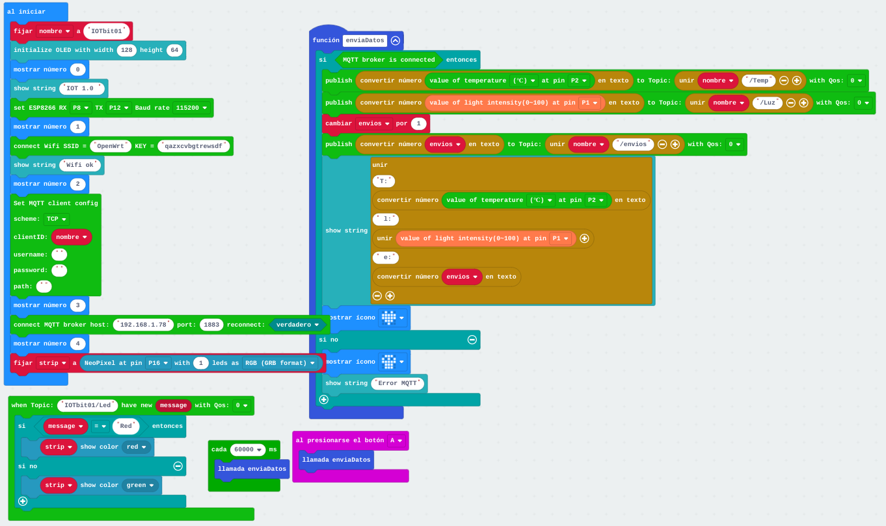
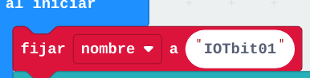

# Programa IOT

Con el montaje actual vamos a usar un programa ya más elaborado que hace muchas cosas:

* Conecta a internet (wifi)
* Conecta con el servidor (Raspberry)
* Mide la temperatura y la luz
* Envía los datos al servidor
* Espera órdenes del servidor
* Si el servidor recibe una temperatura menor que 22 le ordena que ponga el led verde y si es mayor rojo

Este trasiego de datos y órdenes es lo que llamamos IOT

[Programa IOT](https://makecode.microbit.org/_63RcvY9U55YD)

* Cambia el nombre de tu dispositivo con tu número

Programa tu placa (recuerda que para programarla necesitas conectarle el USB a la micro:bit)

Para que funcione bien cambiamos el cable USB para que alimente la placa IOT:bit

