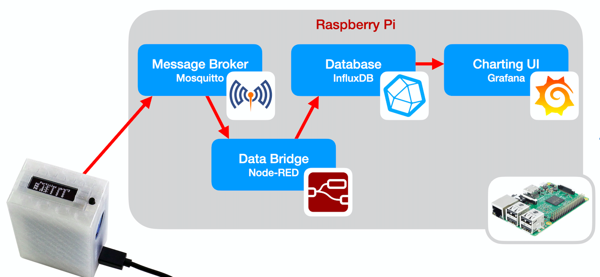

# Arquitectura IOT

Para que la raspberry pi actúe como un servidor de IOT, necesitamos que estén instalados y funcionando al menos 4 servicios, que reciben, formatean, almacenan y muestran los datos



* Mosquitto - servidor (Broker) MQTT al que  se conectan los dispositivos remotos usando el protocolo MQTT. Es el servidor al que nos conectamos, en el programa pondremos los datos de conexión (wifi), IP y puerto del servidor. También necesitamos especificar el protocolo MQTT y por eso usamos bloques para este tipo de conexión
* Node-RED - servicio que convierte los datos recibidos desde MQTT en un formato adecuado para procesarlos, convirtiendo los datos en valores decimales y añadiéndoles fecha y hora de recepción. Una vez convertidos los inserta en la base de datos. Necesitamos establecer un 
* InfluxDB - base de datos donde se guardan los datos recibidos, preparándolos para que se puedan procesar, filtrar, generar acumulados, promedios...
* Grafana - sistema de visualización de datos que nos permite filtrar, agregar y mostrar gráficamente

## Programa IOT micro:bit

[Programa IOT micro:bit https://makecode.microbit.org/_87FFWdKXU5ez](https://makecode.microbit.org/_87FFWdKXU5ez)


## Mosquitto
Configuración Wifi para conectividad: SSID y contraseña
Configuración broker MQTT: IP y puerto

Cada micro:bit tiene un nombre distinto para poder distinguir los datos de cada uno. Los datos que se envía van etiquetados con ese nombre

Veremos en la pantalla OLED los datos que se envían

Si estamos habituados a trabajar con la raspberry Pi, podemos comprobar que los datos que llegan al servidor con el comando 

```sh
mosquitto_sub -h 192.168.1.100 -t "#" -d
```

y veremos los datos que llegan

```sh
Client mosqsub|18752-raspi4 received PUBLISH (d0, q0, r0, m0, 'IOTbit01/Temp', ... (2 bytes))
24
Client mosqsub|18752-raspi4 received PUBLISH (d0, q0, r0, m0, 'IOTbit01/rele', ... (2 bytes))
On
Client mosqsub|18752-raspi4 received PUBLISH (d0, q0, r0, m0, 'IOTbit01/Luz', ... (1 bytes))
8
Client mosqsub|18752-raspi4 received PUBLISH (d0, q0, r0, m0, 'IOTbit01/envios', ... (2 bytes))
```

## Node-Red

En Node-Red definimos los flujos de datos para transformar los datos que envía la micro:bit (que vienen en formato texto) en datos numéricos, etiquetándolos con fecha y hora. Podemos conectarnos desde un navegador a  http://raspiIP:1880 (sustituyendo raspiIP por la IP de la Raspberry Pi)


Cuando se recibe un dato, se filtra por el nombre, se convierte a número y por un lado se guarda en la base de datos y por otro se comprueba si la temperatura es mayor o menor de 22 grados se envía una orden para hacer que el led se ilumine en rojo o en verde

Por cada placa micro:bit, con un nombre distinto tenemos que crear una copia de esta regla con la etiqueta adecuada según el nombre de la placa tanto en la recepción de datos como en el guardado de datos en la base de datos.

Podemos copiar todo el flujo con Ctrl+C y hacer una copia con Ctrl+V 

En el nuevo cambiamos la etiqueta del paquete que se recibe y en el nodo de grabación de datos. También deberíamos cambiar el nombre paquete para control del LED por el correspondiente a su número

Hacemos "Deploy"

## InfluxDB

Datos guardados en formato de series temporales para facilitar su recuperación

## Grafana

Creamos cada gráfica que queremos mostrar. Filtramos los datos según lo que queramos mostrar. Para ello tenemos que haber recibido algunos datos.

http://raspiIP:3000 con usuario/contraseña admin/ParqueCiencias55

[Vídeo resumen](https://youtu.be/yV0yYC0gze0)
[](https://youtu.be/yV0yYC0gze0)

