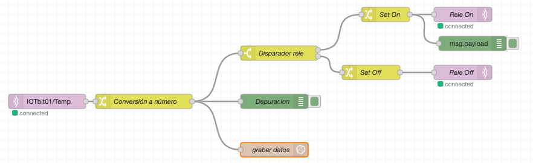

# Arquitectura IOT

Para que la raspberry pi actúe como un servidor de IOT, necesitamos que estén instalados y funcionando al menos 4 servicios, que reciben, formatean, almacenan y muestran los datos

* Mosquitto - servidor (Broker) MQTT al que se se conectan los dispositivos remotos usando el protocolo MQTT. Es el servidor al que nos conectamos, en el programa pondremos los datos de conexion (wifi), IP y puerto del servidor. También necesitamos especificar el protocolo MQTT y por eso usamos bloques para este tipo de conexión
* Node-RED - servicio que convierte los datos recibidos desde MQTT en un formato adecuado para procesarlos, conviertendo los datos en valores decimales y añadiéndoles fecha y hora de recepción. Una vez convertidos los inserta en la base de datos. Necesitamos establecer un 
* InfluxDB - base de datos donde se guardan los datos recibidos, preparándolos para que se puedan procesar, filtrar, generar acumulados, promedios...
* Grafana - sistema de visualización de datos que nos permite filtrar, agregar y mostrar gráficamente

## Programa IOT micro:bit

[Programa IOT micro:bit https://makecode.microbit.org/_63RcvY9U55YD](https://makecode.microbit.org/_63RcvY9U55YD)

## Mosquitto
Configuración Wifi para conectividad

Configuración broker MQTT

Cada micro:bit tiene un nombre distinto para poder distinguir los datos de cada uno. Los datos que se envía van etiquetados con ese nombre

## Node-Red

Flujos para transformar los datos que envía la micro:bit en datos numéricos, etiquetándolos  con fecha y hora

http://raspiIP:1880

Cuando se recibe un dato, se filtra por el nombre, se convierte a número y por un lado se guarda en la base de datos y por otro se comprueba si la temperatura es mayor o menor de 22 grados se envía una orden para hacer que el led se ilumine en rojo o en verde

Por cada placa micro:bit, con un nombre distinto tenemos que crear una copia de esta regla con la etiqueta adecuada según el nombre de la placa.

Podemos copiar todo el flujo con Ctrl+C y hacer una copia con  Ctrl+V 

En el nuevo cambiamos la etiqueta del paquete

Hacemos "Deploy"

## InfluxDB

Datos guardados en formato de series temporales para facilitar su recuperación

## Grafana

Creamos cada gráfica que queremos mostrar. Filtramos los datos según lo que queramos mostrar

## raspiIP:3000
## admin/ParqueCiencias55