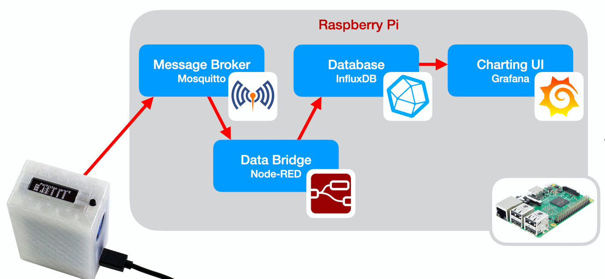

# Arquitectura IOT

Para que la raspberry pi actúe como un servidor de IOT, necesitamos que estén instalados y funcionando al menos 4 servicios, que reciben, formatean, almacenan y muestran los datos

* Mosquitto - servidor MQTT al que se se conectan los dispositivos remotos usando el protocolo MQTT
* Node-Red - servicio que convierte los datos recibidos desde MQTT en un formato adecuado para procesarlos, conviertendo los datos en valores decimales y añadiéndoles fecha y hora de recepción. Una vez convertidos los inserta en la base de datos
* InfluxDB - base de datos donde se guardan los datos recibidos, preparándolos para que se puedan procesar, filtrar, generar acumulados, promedios...
* Grafana - sistema de visualización de datos que nos permite filtrar, agregar y mostrar gráficamente

## Mosquitto

## Node-Red

## InfluxDB

## Grafana