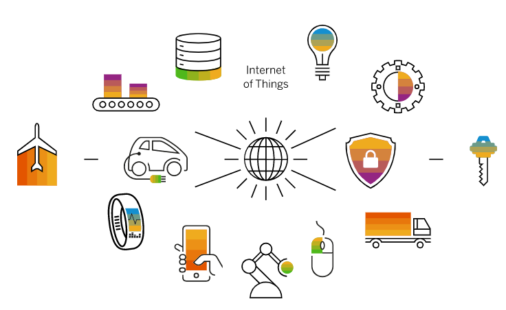

# ¿Qué es IOT?

La Internet de las cosas (IoT, por sus siglas en inglés) se refiere a la conectividad de dispositivos cotidianos a Internet, permitiendo que estos dispositivos puedan enviar y recibir datos y puedan ser controlados a través de Internet. Estos dispositivos pueden incluir desde electrodomésticos comunes como termóstatos inteligentes y aspersores de jardín hasta dispositivos industriales como sensores de monitoreo y equipos de producción.

La IoT tiene el potencial de mejorar la eficiencia y la productividad al permitir que los dispositivos se comuniquen y se controlen automáticamente sin la intervención humana. También puede proporcionar una mayor cantidad de datos y análisis para tomar decisiones informadas y mejorar la toma de decisiones en una amplia variedad de aplicaciones.

A medida que más dispositivos se conectan a Internet, la IoT está creciendo rápidamente y está teniendo un impacto cada vez mayor en la forma en que vivimos y trabajamos.