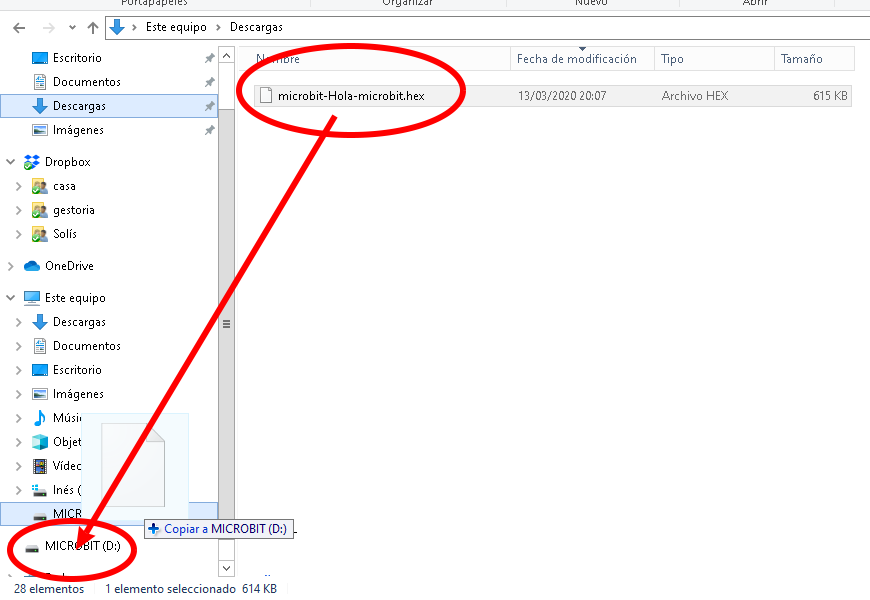

# Preguntas frecuentes

* Si queremos cambiar el idioma del entorno

* Podemos cambiar el nombre del programa editándolo en la caja de abajo.

* Si quiero compartir mi programa o me lo quiero "llevar" puedes pulsa el icono compartir

Y en la ventana que aparece podemos copiar el enlace

* Si al intentar programar la micro:bit no conecta: 
    * Revisa el cable USB. ¿es un cable de datos? ¿no será un cable de carga?
    * El cable tiene que estar conectado a la micro:bit
    * Desconecta y Conécta

* Si no funciona el emparejamiento, al conecta la micro:bit veremos que aparece en el ordenador como si hubiéramos conectado un USB llamado "Microbit"

    * Descargamos el fichero del programa

    * Copiamos el fichero al "pen drive microbit"

