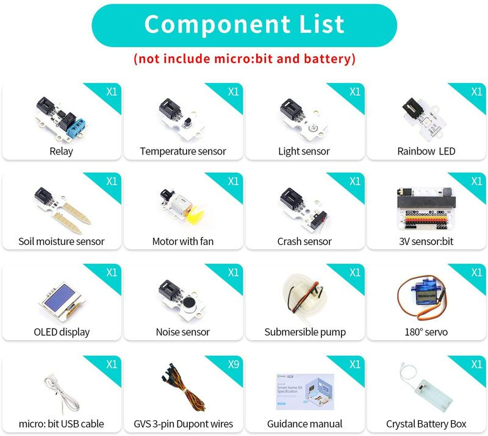
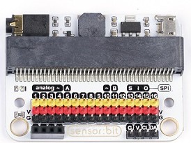
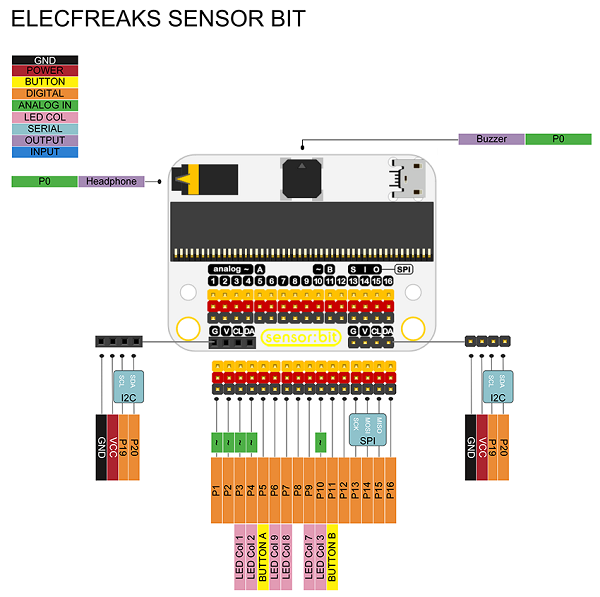
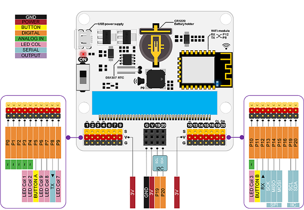
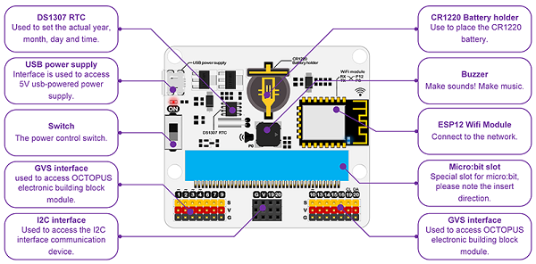
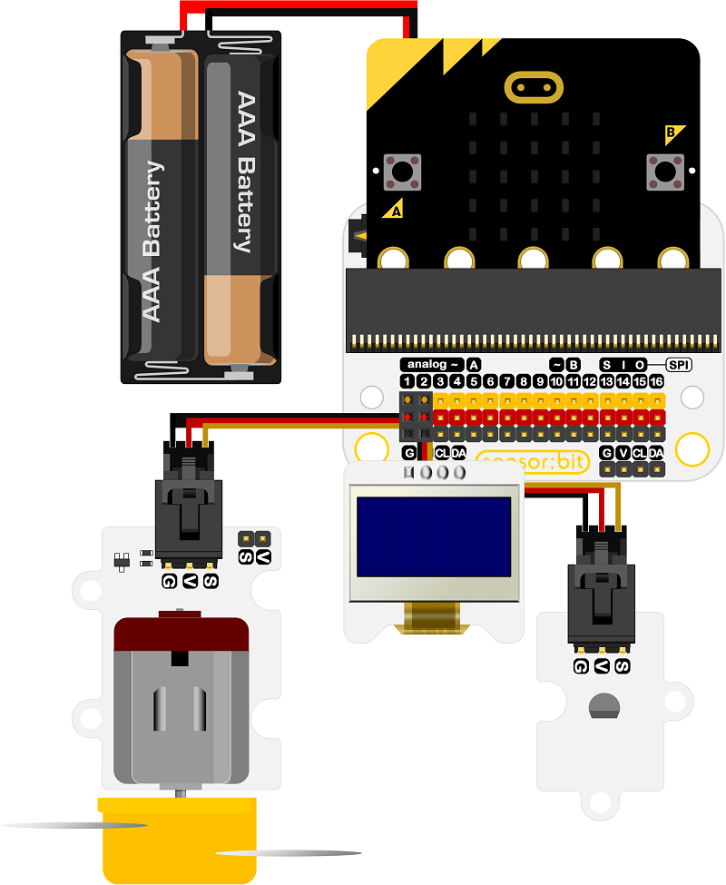
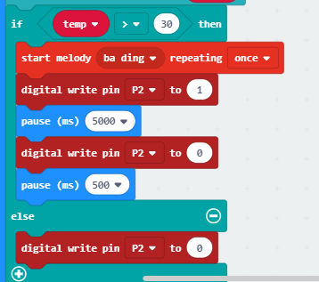
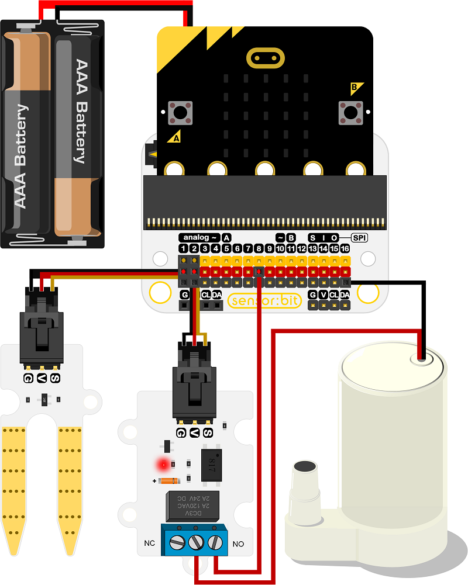
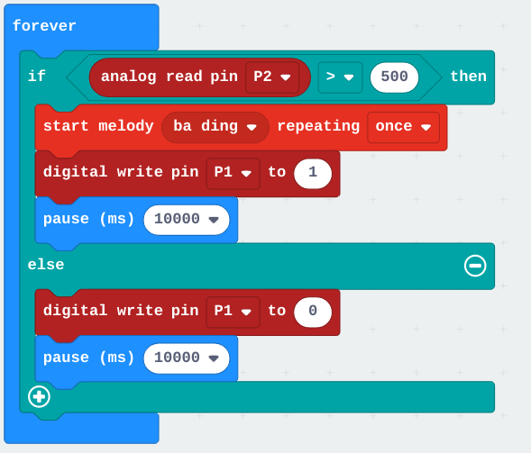

# SmartHome + IOT

[Kit Smart Home]()

Componentes

Sensor:bit

Pinout

## Extensión

[Documentación - Smart Home - (EF08197/EF08198)](https://www.elecfreaks.com/learn-en/microbitKit/smart_home_kit/index.html)

## IOT:bit

[Documentación - IOT:bit](https://www.elecfreaks.com/learn-en/microbitKit/iot_kit/iot_bit.html)

[Kit IOT](https://www.elecfreaks.com/learn-en/microbitKit/iot_kit/iot_kit.html)

Pinout

Components

Extensión IOT:bit

Topics
    IOT0x/Temp 
    IOT0x/Luz

# Centralita MQTT

Raspberry Pi

MQTT broker - mosquitto

node-red

influxDB

Grafana

# Taller

[ejemplo base con las 2 extensiones](https://makecode.microbit.org/_Pc97bc1q3ifF)

## Ventilador automático

1. Pantalla
1. Temperatura en pantalla

Programa

[Programa](https://makecode.microbit.org/_PKXir0c1V6TX)

## Riego automático

Programa

[Programa](https://makecode.microbit.org/_9KqHhp1J45ho)

